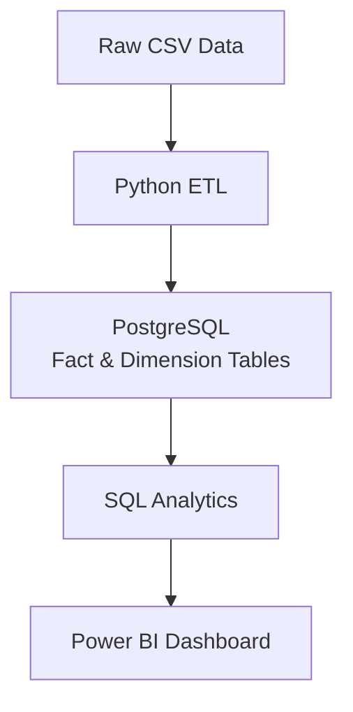
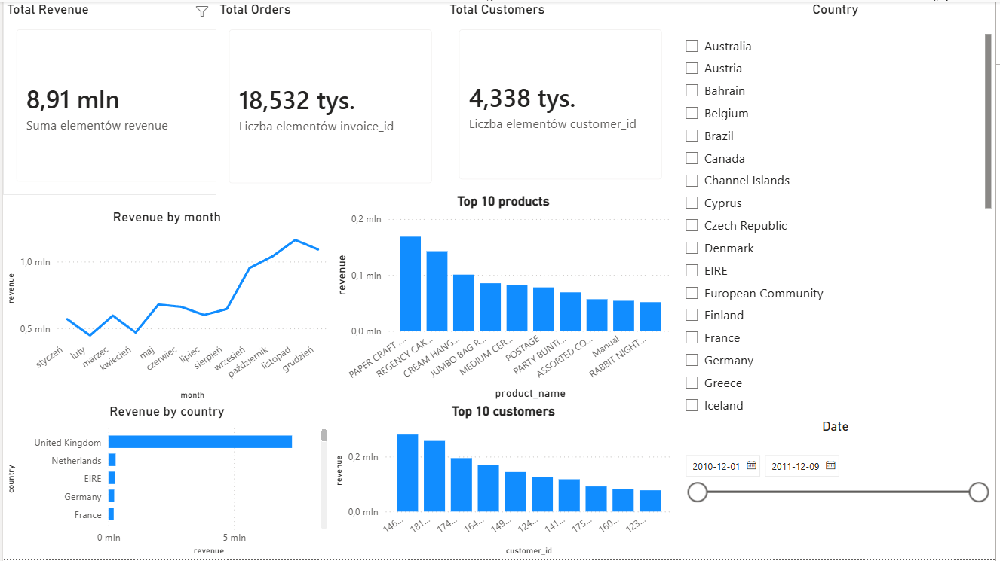

# E-commerce Data Pipeline

## Project Description

Project description

This project presents a simple end-to-end data pipeline built on an e-commerce dataset. The data is cleaned in Python, loaded into PostgreSQL, transformed into a star schema, analyzed with SQL, and visualized in Power BI.

## Project Architecture



## Tech Stack

Python (Pandas)
PostgreSQL
SQL
SQLAlchemy
Power BI

## ETL Process

The ETL script performs basic data cleaning before loading the dataset into PostgreSQL.

Steps:

remove rows with missing customer IDs
remove negative quantities
remove products with non-positive prices
convert invoice dates to datetime format
save the cleaned dataset

## Data Model

The database uses a simple star schema.

Fact table:
-fact_sales

Dimension tables:
-dim_customers
-dim_products

## SQL Analysis

Example analyses include:

-total revenue
-monthly revenue trend
-top customers
-top products
-revenue by invoice
-orders per customer

## Power BI Dashboard

The dashboard includes:

-Total Revenue
-Total Orders
-Total Customers
-Revenue by Month
-Revenue by Country
-Top 10 Products
-Top 10 Customers
-Country and Date filters



## Repository Structure

```text
ecommerce-data-pipeline/
│
├── data/
│   ├── Raw/
│   │   └── Online_Retail.csv
│   └── Processed/
│       └── cleaned_online_retail.csv
│
├── docs/
│   └── BI-1.PNG
│
├── sql/
│   ├── analytics_queries.sql
│   ├── dim_customers.sql
│   ├── dim_products.sql
│   └── fact_sales.sql
│
├── src/
│   ├── explore_data.py
│   ├── clean_data.py
│   └── load_to_postgres.py
│
├── requirements.txt
├── README.md
└── .gitignore
```